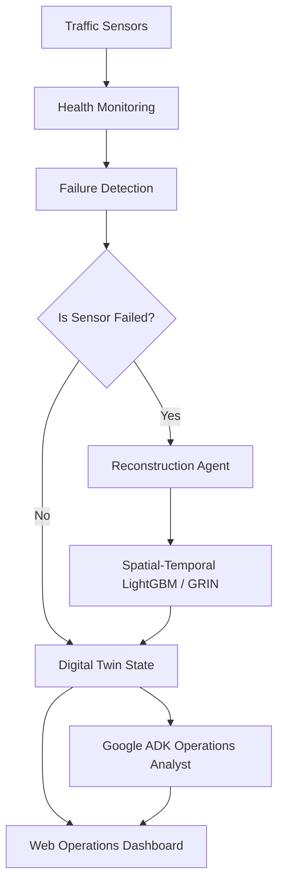

# TraffiTwin AI

**Self-Healing Traffic Digital Twin for Resilient Smart City Operations**

*   **Live Demo:** [traffitwin-ai.web.app](https://traffitwin-ai.web.app)
*   **Backend API:** [sahilmangla-traffitwin-backend.hf.space](https://sahilmangla-traffitwin-backend.hf.space)
*   **API Docs:** [sahilmangla-traffitwin-backend.hf.space/docs](https://sahilmangla-traffitwin-backend.hf.space/docs)

[](https://www.python.org/)
[](https://fastapi.tiangolo.com/)
[](https://react.dev/)
[](https://github.com/microsoft/LightGBM)
[](https://github.com/google/agent-development-kit)
[](https://deepmind.google/technologies/gemini/)
[](LICENSE)

---

## Project Overview

TraffiTwin AI is an AI-powered, self-healing traffic digital twin designed to maintain continuous situational awareness for urban transportation networks during telemetry outages. 

Modern intelligent transportation systems (ITS) depend heavily on real-time sensor streams. When physical loop detectors or traffic cameras fail due to hardware malfunctions, network dropouts, or power issues, traffic control centers lose visibility into congestion and incident states. TraffiTwin AI resolves this vulnerability by detecting telemetry failures in real time and automatically reconstructing missing traffic states using spatial-temporal graph-aware machine learning models. 

The system operates on the standard **METR-LA** dataset and integrates a high-fidelity traffic simulation, LightGBM-based state reconstruction, a Google ADK-powered Operations Analyst, and an interactive real-time dashboard.

---

## Problem Statement

Traffic Management Centers (TMCs) rely on continuous telemetry to coordinate emergency responses, run adaptive signal timing plans, and detect congestion anomalies. Physical sensor outages create critical blind spots, causing traditional adaptive traffic control systems to degrade rapidly or fall back to static, inefficient historical timing patterns.

```
┌────────────────┐     ┌────────────────┐     ┌─────────────────────┐     ┌────────────────────────┐
│ Sensors Online │ ──> │ Sensor Failure │ ──> │   AI Reconstruction │ ──> │ Digital Twin Restored  │
│ (Normal Flow)  │     │ (Blind Spots)  │     │ (Self-Healing State)│     │ (Situational Awareness)│
└────────────────┘     └────────────────┘     └─────────────────────┘     └────────────────────────┘
```

TraffiTwin AI bridges this gap, serving as an algorithmic backup layer that estimates actual traffic speeds across failed nodes, ensuring digital twins remain continuous, robust, and operational.

---

## Why It Matters

*   **Continuous Observability:** Eliminates data gaps, ensuring traffic operators maintain a complete network state snapshot at all times.
*   **Infrastructure Resilience:** Mitigates the risk of physical hardware degradation without requiring immediate, expensive field maintenance.
*   **Robust Downstream Decision Support:** Feeds downstream routing services and signal optimization engines with stable, uninterrupted state estimates.
*   **Production-Ready Hybrid Intelligence:** Deploys a self-healing sensor pipeline combining fast ML regressors with conversational LLM reasoning.

---

## Key Achievements

*   **207 Traffic Sensors:** Full spatial-temporal simulation of the METR-LA sensor network topology.
*   **34,272 Timesteps:** Thorough model evaluation and verification across extensive historical real-world telemetry.
*   **97.03% Flow Coverage Ratio:** Observability restoration across the road network under sensor failure conditions.
*   **2.48 mph Mean Absolute Error (MAE):** State reconstruction accuracy restoring traffic speeds close to ground-truth values.
*   **Google ADK Operations Analyst:** Conversational AI reasoning directly over live digital twin telemetry.
*   **Deterministic Fallback Engine:** Rule-based fallback mechanism guaranteeing uptime during LLM API throttling or network interruptions.
*   **Comprehensive Testing Suite:** 208 backend tests (92%+ coverage, enforced in CI), 51 frontend unit/component tests, and 3 end-to-end Playwright flows — covering simulation state, metrics, domain logic, API endpoints, error handling, and the full incident-detection-to-summary service chain.
*   **Automated CI/CD Pipeline:** GitHub Actions workflow running Ruff, mypy (blocking), pytest with a coverage gate, frontend unit tests, Playwright E2E tests, and dependency vulnerability scans, then deploying automatically to Hugging Face Spaces (backend) and Firebase Hosting (frontend).
*   **Firebase + Hugging Face Deployment:** Decoupled architecture serving assets globally with sub-second API roundtrips.

---

## Technology Stack

| Layer | Component Technologies |
| :--- | :--- |
| **Frontend** | React 19, Vite, Zustand, Tailwind CSS, React Force Graph 2D, Framer Motion |
| **Backend** | Python 3.10, FastAPI, Uvicorn, CORS Middleware, Dotenv |
| **Machine Learning** | LightGBM, NumPy, SciPy (METR-LA adjacency matrix propagation) |
| **AI Agent** | Google Agent Development Kit (ADK) |
| **LLM** | Google Gemini 2.5 Flash |
| **Dataset** | METR-LA loop detector telemetry (207 sensors, 34,272 timesteps) |
| **Deployment** | Firebase Hosting (Frontend), Hugging Face Spaces (Backend Docker container) |

---

## System Architecture

The following diagram illustrates the flow of real-time telemetry from physical sensors through failure detection, ML reconstruction, state visualization, and conversational intelligence:



---

## Key Features

| Feature | Description |
| :--- | :--- |
| **Real-time Digital Twin** | Visualizes traffic flow speeds across 207 sensor locations in the METR-LA network with a sub-second refresh rate. |
| **Sensor Failure Simulation** | Allows operators to manually inject failure states (temporary or permanent) into any individual node directly via the UI. |
| **Self-Healing Reconstruction** | Instantly replaces missing sensor values with virtual sensor readings generated by ML models. |
| **Spatial Feature Engineering** | Leverages 2-hop spatial neighborhood features and historical temporal profiles to achieve highly accurate speed predictions. |
| **Embedded ADK Analyst** | Features a smart city operations assistant capable of answering complex telemetry queries over live digital twin states. |
| **Benchmarking Framework** | Compares reconstruction performance against standard baselines (Historical Mean, Spatial K-Nearest Neighbors). |
| **Interactive Event Logs** | Displays a scrollable operations timeline tracking sensor failures, AI response engagements, and physical recoveries. |

---

## Technical Highlights

*   **Network Scale:** Simulates 207 sensor nodes over 34,272 chronological timesteps based on the METR-LA dataset.
*   **Leakage Prevention:** Uses rigorous chronological train-test splits (70% train, 30% test) to prevent temporal data leakage.
*   **Spatial Neighborhoods:** Implements 2-hop graph feature propagation, using the physical coordinates and graph topology of the METR-LA road network.
*   **High-Throughput Inference:** Features a FastAPI inference pipeline that executes ML reconstructions in under 5 milliseconds.

---

## Benchmark Results

The state reconstruction models are evaluated on root mean squared error (RMSE), mean absolute error (MAE), mean absolute percentage error (MAPE), and Flow Coverage Ratio (FCR).

| Model | MAE (mph) | RMSE (mph) | MAPE | Flow Coverage Ratio (FCR) |
| :--- | :---: | :---: | :---: | :---: |
| **Historical Mean Baseline** | ~6.50 | — | ~18.00% | 100.00% |
| **TraffiTwin LightGBM Regressor** | **2.48** | **7.82** | **6.06%** | **97.03%** |

> [!NOTE]  
> The LightGBM model achieves near-ground-truth reconstruction accuracy, restoring over 97% network observability while keeping MAE under 2.5 mph.

---

## Google Ecosystem Integration

TraffiTwin AI leverages the Google developer ecosystem to power live operational intelligence and deliver high-availability hosting:

*   **Gemini 2.5 Flash:** Acts as the cognitive core for the Operations Analyst, performing real-time reasoning over system states and diagnosing metrics.
*   **Google Agent Development Kit (ADK):** Used to construct the conversational agent, coordinate tool registration (providing API-backed network queries), and format responses.
*   **Google AI Studio:** Utilized for rapid prompt engineering, system instruction testing, and generating development keys for the Gemini API.
*   **Firebase Hosting:** Delivers the compiled React 19 frontend assets globally with low latency, fast page load speeds, and robust static hosting.

---

## AI Operations Analyst

The AI Operations Analyst is embedded directly inside the web dashboard to assist traffic operators in real time. 

*   **Live Reasoning:** The ADK agent evaluates the live Digital Twin state, tracking sensor health, active failures, and speed metrics.
*   **Real-time Queries:** Operators can converse with the agent directly in the panel to ask questions like *"Which sensors are currently offline?"* or *"Summarize recent incidents."*
*   **Deterministic Fallback Logic:** If the Gemini API becomes unavailable due to rate limits, network issues, or credential errors, the analyst seamlessly falls back to a deterministic, rule-based reasoning engine. This guarantees continuous operational responses in the dashboard under all conditions.

```
        User Query
            │
            ▼
     Google ADK Agent
            │
            ▼
     Gemini 2.5 Flash
            │
     ┌──────┴──────┐
     │   Success?  │
     └─┬─────────┬─┘
       │ Yes     │ No
       ▼         ▼
   Response  Deterministic Fallback Engine
                 (Guaranteed Operational Output)
```

---

## Deployment

*   **Frontend Web App:** [https://traffitwin-ai.web.app](https://traffitwin-ai.web.app) (Hosted on Firebase Hosting)
*   **Backend API Services:** [https://sahilmangla-traffitwin-backend.hf.space](https://sahilmangla-traffitwin-backend.hf.space) (Hosted on Hugging Face Spaces via Docker)
*   **Interactive API Docs:** [https://sahilmangla-traffitwin-backend.hf.space/docs](https://sahilmangla-traffitwin-backend.hf.space/docs) (Swagger/OpenAPI documentation)

---

## Future Work

*   **GRIN Reconstruction Model:** Transitioning from tree-based regression to Graph Recurrent Imputation Networks to model complex temporal dynamics.
*   **CityFlow V2 Integration:** Supporting dynamic traffic micro-simulations to study the downstream impacts of self-healing sensors on traffic light timing optimization.
*   **Multi-Feature Reconstruction:** Expanding prediction parameters to include precipitation, lane construction data, and public holiday temporal profiles.
*   **Online Learning:** Developing continuous training loops to update the baseline regressor as new telemetry drift is observed.
*   **Vertex AI Deployment:** Migrating backend training and model endpoints to Vertex AI for enterprise-scale orchestration and monitoring.

---

## Repository Structure

```
TraffiTwin-AI/
├── agents/
│   └── traffic_resilience_agent/   # Google ADK Agent
│       ├── agent.py                 # Agent declaration & models
│       ├── prompts.py               # Analyst system instructions
│       ├── tools.py                 # API-backed data fetchers
│       └── README.md                # Agent documentation
├── backend/
│   ├── api/                         # FastAPI router, app config, and exception handlers
│   ├── services/                    # Core backend service singletons
│   ├── twin/                        # Simulation state and stream simulator
│   ├── models/                      # Feature engineering, LightGBM reconstructor, evaluator
│   └── data/                        # METR-LA loader, preprocessing, failure simulator
├── tests/                           # Backend pytest suite (unit, API, integration)
├── scripts/                         # Standalone scripts (e.g. validate_pipeline.py)
├── frontend/
│   ├── src/
│   │   ├── components/              # React UI elements (Header, OperationsRail, BriefingModal)
│   │   ├── store/                   # Zustand state managers
│   │   ├── hooks/                   # Polling/autoplay hooks
│   │   ├── test/                    # Vitest setup (motion/react mock, jest-dom)
│   │   ├── App.tsx                  # Main layout container
│   │   └── index.css                # Global styles & design system
│   ├── e2e/                         # Playwright end-to-end specs
│   ├── package.json                 # Frontend dependencies
│   └── vite.config.ts               # Vite configuration
├── requirements.txt / requirements-dev.txt   # Pinned lockfiles (pip-compile) — edit requirements*.in instead
├── pyproject.toml                   # Ruff configuration
├── CONTRIBUTING.md                  # Local setup + testing expectations for contributors
└── README.md                        # Project documentation
```

---

## Getting Started

### Prerequisites
*   Python 3.10+
*   Node.js 18+
*   Gemini API Key (optional, for Gemini-backed conversational intelligence)

### Clone the Repository
```bash
git clone https://github.com/sahil-mangla/TraffiTwin-AI.git
cd TraffiTwin-AI
```

### Backend Setup
1. Create a virtual environment and activate it:
   ```bash
   python3 -m venv .venv
   source .venv/bin/activate
   ```
2. Install python dependencies (pinned, pip-compile-generated lockfiles — see `requirements.in`/`requirements-dev.in` for the source of truth):
   ```bash
   pip install -r requirements.txt -r requirements-dev.txt
   ```
3. Set environment variables in a `.env` file at the **repository root** (loaded via `load_dotenv()` in `backend/api/app.py`, relative to wherever `uvicorn` is launched from):
   ```env
   GEMINI_API_KEY=your_gemini_api_key_here
   ```

### Frontend Setup
1. Navigate to the frontend directory:
   ```bash
   cd frontend
   ```
2. Install npm dependencies:
   ```bash
   npm install
   ```

---

## Running the Project

### 1. Launch Backend Server
From the root directory, run the FastAPI application:
```bash
uvicorn backend.api.app:app --reload
```
The API documentation will be available at `http://localhost:8000/docs`.

### 2. Launch Frontend Application
From the `frontend/` directory, start the Vite development server:
```bash
npm run dev
```
Open `http://localhost:5173` in your web browser.

### 3. Run Standalone ADK Agent (Optional)
The Google ADK-powered Traffic Operations Analyst is automatically available inside the dashboard once the backend is running. For standalone debugging, CLI interaction, and evaluation, developers may optionally launch the agent directly:
```bash
adk run agents/traffic_resilience_agent
```

---

## Testing

TraffiTwin AI is tested at three levels — backend unit/integration tests, frontend unit/component tests, and end-to-end browser tests — all wired into CI (see `.github/workflows/ci.yml`).

### Backend (pytest)

From the repository root, with your virtual environment active:

```bash
# Full suite
pytest tests/ -v

# With coverage (CI enforces --cov-fail-under=85; current coverage is ~92%)
pytest tests/ -v --cov=backend --cov-report=term-missing --cov-fail-under=85
```

The suite (208 tests) is organized by what it exercises:

*   **Unit tests** — one file per service/module (`test_preprocessing.py`, `test_failure_simulator.py`, `test_loader.py`, `test_lightgbm_reconstructor.py`, `test_dataset.py`, `test_circuit_breaker.py`, `test_rate_limiter.py`, `test_rule_based_reporter.py`, `test_gemini_service.py`, `test_metrics_service.py`, `test_twin_service.py`, `test_reconstruction_service.py`, `test_incident_intelligence_service.py`, `test_config.py`, `test_stream_simulator.py`).
*   **API tests** (`test_routes.py`, `test_error_handling.py`, `test_cors.py`) — every endpoint's success path plus its documented error responses (404/422/503/500), all normalized to a consistent `{"detail", "error_code"}` shape.
*   **Integration tests** (`test_integration_flow.py`, `test_service_chain_integration.py`) — the former drives the full HTTP stack through `TestClient` with only the incident service faked; the latter wires the *real* `TwinService` → `ReconstructionService` → `IncidentIntelligenceService` chain together (only the outbound Gemini network call is stubbed), verifying failure injection actually triggers reconstruction, healing clears it, and the rate limiter/circuit breaker/deduplicator behave correctly under repeated real incidents.

Static analysis, run the same way CI does:

```bash
mypy backend --ignore-missing-imports   # blocking — must be error-free
ruff check . --select=F63,F7,F82        # blocking tier — correctness only
ruff check . --exit-zero --statistics   # advisory tier — full style/complexity
```

### Frontend (Vitest + Testing Library)

From `frontend/`:

```bash
npm test                 # run once
npm run test:watch       # watch mode
npm run test:coverage    # with coverage
```

51 tests cover the Zustand store (event/banner diffing logic), the `useSystemState`/`useAutoPlay` hooks (polling, autoplay loop, cleanup on unmount), and every interactive component (`ControlDock`, `BriefingModal`, `EventTimeline`, `IncidentDrawer`, `BackendOfflineOverlay`). `motion/react` is mocked in `src/test/setup.ts` so `AnimatePresence` exit animations — which never resolve under jsdom — don't leave stale elements in the DOM.

### End-to-end (Playwright)

From `frontend/`, with the backend's Python dependencies installed (Playwright boots a real `uvicorn` backend alongside the Vite dev server — see `playwright.config.ts`):

```bash
npx playwright install --with-deps chromium   # one-time browser install
npm run test:e2e
```

Three specs drive the real app end-to-end in a real browser: injecting a sensor failure and confirming it reaches the event log, running the autoplay loop and pausing it, and rejecting invalid failure-injection input client-side.

---

## Example Workflow

1.  **Launch the System:** Start the backend and frontend servers. Open the web interface.
2.  **Acknowledge Mission Protocol:** Read and close the startup briefing modal.
3.  **Inject Anomaly:** Select a node in the web visualization and trigger a sensor failure.
4.  **Observe Autonomic Repair:** Note the live transition of the node to a "Reconstructed" state and verify that overall network observability recovers above 97%.
5.  **Audit via AI Analyst:** Use the "Ops Intelligence" panel to query: *"Which sensors are offline?"* and observe the exact virtual readings and metrics generated.

---

## Research Foundations

1.  **DCRNN:** Li et al., *Diffusion Convolutional Recurrent Neural Network: Data-Driven Traffic Forecasting*, ICLR 2018.
2.  **Graph WaveNet:** Wu et al., *Graph WaveNet for Deep Spatial-Temporal Graph Modeling*, IJCAI 2019.
3.  **GRIN:** Cini et al., *Filling the Gaps: Multivariate Time Series Imputation by Graph Recurrent Networks*, ICLR 2022.
4.  **LightGBM:** Ke et al., *LightGBM: A Highly Efficient Light Gradient Boosting Decision Tree*, NeurIPS 2017.

---

## Contributing

Contributions are welcome. See [CONTRIBUTING.md](CONTRIBUTING.md) for local setup and the testing/quality bar (Ruff, mypy, pytest coverage, Vitest, Playwright) every PR is expected to meet.

---

## License

This project is licensed under the MIT License - see the [LICENSE](LICENSE) file for details.
