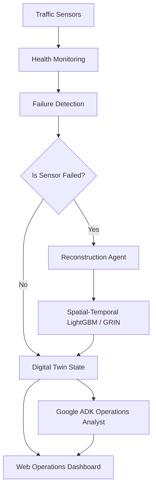

# TraffiTwin AI

> **Self-Healing Traffic Digital Twin for Resilient Smart City Operations**

[](https://www.python.org/)
[](https://fastapi.tiangolo.com/)
[](https://react.dev/)
[](https://github.com/microsoft/LightGBM)
[](https://github.com/google/agent-development-kit)
[](https://deepmind.google/technologies/gemini/)
[](LICENSE)

---

## Project Overview

TraffiTwin AI is an AI-powered, self-healing traffic digital twin that preserves urban situational awareness during telemetry outages. 

Modern intelligent transportation systems (ITS) depend heavily on real-time sensor streams. When physical loop detectors or traffic cameras fail due to hardware malfunctions, network dropouts, or power issues, traffic control centers lose visibility into congestion and incident states. TraffiTwin AI resolves this vulnerability by detecting telemetry failures in real time and automatically reconstructing missing traffic states using spatial-temporal graph-aware machine learning models. 

The system operates on the standard **METR-LA** dataset and integrates a high-fidelity traffic simulation, LightGBM-based state reconstruction, a Google ADK-powered Operations Analyst, and an interactive real-time dashboard.

---

## Problem Statement

Traffic Management Centers (TMCs) rely on continuous telemetry to run signal timing plans, detect traffic anomalies, and coordinate emergency responses. Physical sensor outages create critical blind spots, causing traditional adaptive traffic control systems to degrade rapidly or fall back to static, inefficient historical timing patterns.

```
┌────────────────┐     ┌────────────────┐     ┌─────────────────────┐     ┌────────────────────────┐
│ Sensors Online │ ──> │ Sensor Failure │ ──> │   AI Reconstruction │ ──> │ Digital Twin Restored  │
│ (Normal Flow)  │     │ (Blind Spots)  │     │ (Self-Healing State)│     │ (Situational Awareness)│
└────────────────┘     └────────────────┘     └─────────────────────┘     └────────────────────────┘
```

TraffiTwin AI bridges this gap, serving as an algorithmic backup layer that estimates actual traffic speeds across failed nodes, ensuring digital twins remain continuous, robust, and operational.

---

## Why It Matters

*   **Continuous Observability:** Eliminates data gaps, ensuring traffic operators maintain a complete network state snapshot at all times.
*   **Infrastructure Resilience:** Mitigates the risk of physical hardware degradation without requiring immediate, expensive field maintenance.
*   **Robust Downstream Decision Support:** Feeds downstream routing services and signal optimization engines with stable, uninterrupted state estimates.
*   **Production-Ready Hybrid Intelligence:** Deploys a self-healing sensor pipeline combining fast ML regressors with conversational LLM reasoning.

---

## System Architecture

The following diagram illustrates the flow of real-time telemetry from physical sensors through failure detection, ML reconstruction, state visualization, and conversational intelligence:



---

## Key Features

| Feature | Description |
| :--- | :--- |
| **Real-time Digital Twin** | Visualizes traffic flow speeds across 207 sensor locations in the METR-LA network with a sub-second refresh rate. |
| **Sensor Failure Simulation** | Allows operators to manually inject failure states (temporary or permanent) into any individual node directly via the UI. |
| **Self-Healing Reconstruction** | Instantly replaces missing sensor values with virtual sensor readings generated by ML models. |
| **Spatial Feature Engineering** | Leverages 2-hop spatial neighborhood features and historical temporal profiles to achieve highly accurate speed predictions. |
| **Embedded ADK Analyst** | Features a smart city operations assistant capable of answering complex telemetry queries over live digital twin states. |
| **Benchmarking Framework** | Compares reconstruction performance against standard baselines (Historical Mean, Spatial K-Nearest Neighbors). |
| **Interactive Event Logs** | Displays a scrollable operations timeline tracking sensor failures, AI response engagements, and physical recoveries. |

---

## Technical Highlights

*   **Network Scale:** Simulates 207 sensor nodes over 34,272 chronological timesteps based on the METR-LA dataset.
*   **Leakage Prevention:** Uses rigorous chronological train-test splits (70% train, 30% test) to prevent temporal data leakage.
*   **Spatial Neighborhoods:** Implements 2-hop graph feature propagation, using the physical coordinates and graph topology of the METR-LA road network.
*   **High-Throughput Inference:** Features a FastAPI inference pipeline that executes ML reconstructions in under 5 milliseconds.

---

## Benchmark Results

The state reconstruction models are evaluated on root mean squared error (RMSE), mean absolute error (MAE), mean absolute percentage error (MAPE), and Flow Coverage Ratio (FCR).

| Model | MAE (mph) | RMSE (mph) | MAPE | Flow Coverage Ratio (FCR) |
| :--- | :---: | :---: | :---: | :---: |
| **Historical Mean Baseline** | ~6.50 | — | ~18.00% | 100.00% |
| **TraffiTwin LightGBM Regressor** | **2.48** | **7.82** | **6.06%** | **97.03%** |

> [!NOTE]  
> The LightGBM model achieves near-ground-truth reconstruction accuracy, restoring over 97% network observability while keeping MAE under 2.5 mph.

---

## Google Ecosystem Integration

TraffiTwin AI harnesses Google’s developer ecosystem to deliver real-time operational analysis and scalable deployment.

```
       User Query
           │
           ▼
    Google ADK Agent
           │
           ▼
    Gemini 2.5 Flash
           │
    ┌──────┴──────┐
    │   Success?  │
    └─┬─────────┬─┘
      │ Yes     │ No
      ▼         ▼
  Response  Deterministic Fallback Engine
                (Guaranteed Operational Output)
```

### Embedded AI Operations Analyst
The system features an embedded operations analyst powered by **Google Gemini 2.5 Flash** and the **Google Agent Development Kit (ADK)**. Directly accessible in the right-hand panel of the dashboard, the analyst evaluates live system state and answers queries about network health, sensor offline events, and metric anomalies.

> [!IMPORTANT]  
> The analyst is embedded directly into the Operations Center UI and reasons over the live Digital Twin state in real time.

#### Example Operational Queries
*   *"What is happening in the traffic network right now?"*
*   *"Which sensors are currently offline?"*
*   *"Is the network operational?"*
*   *"Summarize recent incidents."*
*   *"What is the speed reading and status of Sensor 42?"*

### Resilient AI Design
To ensure continuous operation in production mission-control centers, the ADK agent implements a **hybrid intelligence architecture**. If the Gemini API experiences network latency, rate limits, or credentials failure, the agent automatically falls back to an internal, deterministic rule-based reasoning engine. This ensures operators receive immediate, accurate system metrics and status summaries without interruption.

---

## Repository Structure

```
TraffiTwin-AI/
├── agents/
│   └── traffic_resilience_agent/   # Google ADK Agent
│       ├── agent.py                 # Agent declaration & models
│       ├── prompts.py               # Analyst system instructions
│       ├── tools.py                 # API-backed data fetchers
│       └── README.md                # Agent documentation
├── backend/
│   ├── api/                         # FastAPI router & app configuration
│   ├── services/                    # Core backend service singletons
│   ├── twin/                        # Simulation state and LightGBM models
│   ├── requirements.txt             # Python dependencies
│   └── main.py                      # Backend entrypoint
├── frontend/
│   ├── src/
│   │   ├── components/              # React UI elements (Header, OperationsRail, BriefingModal)
│   │   ├── store/                   # Zustand state managers
│   │   ├── App.tsx                  # Main layout container
│   │   └── index.css                # Global styles & design system
│   ├── package.json                 # Frontend dependencies
│   └── vite.config.ts               # Vite configuration
└── README.md                        # Project documentation
```

---

## Getting Started

### Prerequisites
*   Python 3.10+
*   Node.js 18+
*   Gemini API Key (optional, for Gemini-backed conversational intelligence)

### Clone the Repository
```bash
git clone https://github.com/sahil-mangla/TraffiTwin-AI.git
cd TraffiTwin-AI
```

### Backend Setup
1. Create a virtual environment and activate it:
   ```bash
   python3 -m venv venv
   source venv/bin/activate
   ```
2. Install python dependencies:
   ```bash
   pip install -r backend/requirements.txt
   ```
3. Set environment variables in a `.env` file within the `backend/` directory:
   ```env
   GEMINI_API_KEY=your_gemini_api_key_here
   ```

### Frontend Setup
1. Navigate to the frontend directory:
   ```bash
   cd frontend
   ```
2. Install npm dependencies:
   ```bash
   npm install
   ```

---

## Running the Project

### 1. Launch Backend Server
From the root directory, run the FastAPI application:
```bash
uvicorn backend.api.app:app --reload
```
The API documentation will be available at `http://localhost:8000/docs`.

### 2. Launch Frontend Application
From the `frontend/` directory, start the Vite development server:
```bash
npm run dev
```
Open `http://localhost:5173` in your web browser.

### 3. Run Standalone ADK Agent (Optional)
The Google ADK-powered Traffic Operations Analyst is automatically available inside the dashboard once the backend is running. For standalone debugging, CLI interaction, and evaluation, developers may optionally launch the agent directly:
```bash
adk run agents/traffic_resilience_agent
```

---

## Example Workflow

1.  **Launch the System:** Start the backend and frontend servers. Open the web interface.
2.  **Acknowledge Mission Protocol:** Read and close the startup briefing modal.
3.  **Inject Anomaly:** Select a node in the web visualization and trigger a sensor failure.
4.  **Observe Autonomic Repair:** Note the live transition of the node to a "Reconstructed" state and verify that overall network observability recovers above 97%.
5.  **Audit via AI Analyst:** Use the "Ops Intelligence" panel to query: *"Which sensors are offline?"* and observe the exact virtual readings and metrics generated.

---

## Research Foundations

This project draws inspiration from state-of-the-art spatial-temporal traffic prediction and reconstruction networks:

1.  **DCRNN:** Li et al., *Diffusion Convolutional Recurrent Neural Network: Data-Driven Traffic Forecasting*, ICLR 2018.
2.  **Graph WaveNet:** Wu et al., *Graph WaveNet for Deep Spatial-Temporal Graph Modeling*, IJCAI 2019.
3.  **GRIN:** Cini et al., *Filling the Gaps: Multivariate Time Series Imputation by Graph Recurrent Networks*, ICLR 2022.
4.  **LightGBM:** Ke et al., *LightGBM: A Highly Efficient Light Gradient Boosting Decision Tree*, NeurIPS 2017.

---

## License

This project is licensed under the MIT License - see the [LICENSE](LICENSE) file for details.
